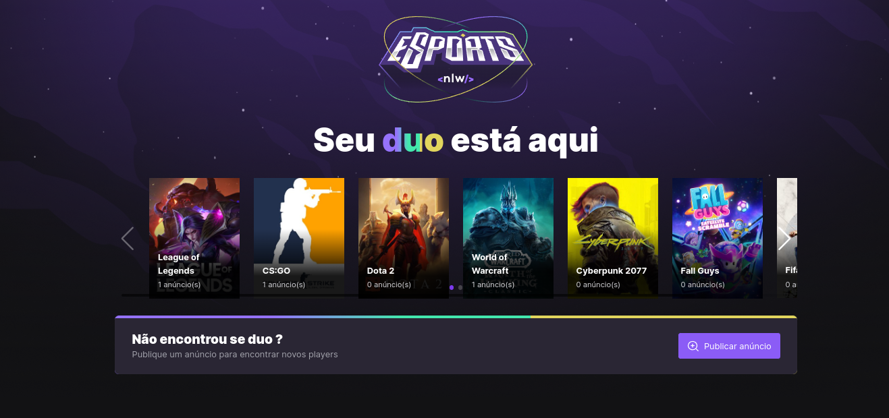
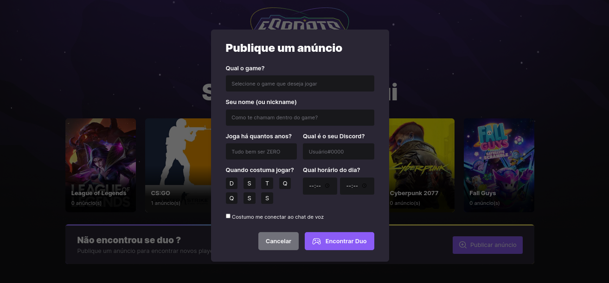

<h1 align="center">
   eSports
</h1>

# Screens




## Technologies used

- [React](https://pt-br.reactjs.org/)
- [Vite](https://vitejs.dev/)
- [Typescript](https://www.typescriptlang.org)
- [Tailwindcss](https://tailwindcss.com/)
- [Radix](https://www.radix-ui.com/)
- [Swiper](https://swiperjs.com/)

## Projeto:

ESports é um App para você convidar um amigo(a) para aquela jogatina, é só conectar no app e convidar o amigo(a)

## Requirements

You need to install both [Node.js](https://nodejs.org) and [Yarn](https://yarnpkg.com) or npm to run this project.

## How to use it

```bash
  # Install the dependencies
  $ yarn install
  # Run the web server
  $ yarn dev
```

The app will be available for access on your browser at (http://localhost:3000)
